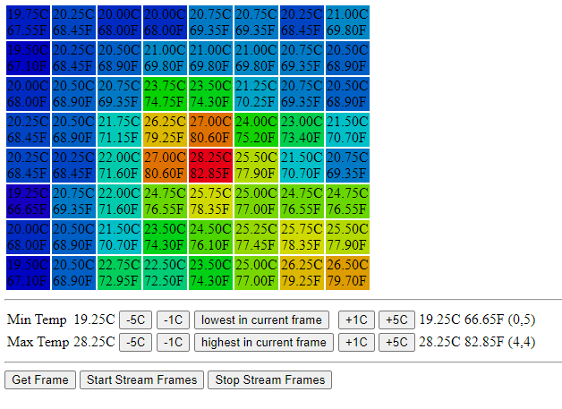

# WebBasedThermalCamera
Thermal Camera (AMG8833) displayed using web server and websocket on ESP32-CAM module

- Here is the interface:
  - 

- Here is the wiring:
  - 

# TODO
- ~Add option for continious running~

# The process so far
- Started with https://github.com/acrobotic/Ai_Tips_ESP8266/tree/master/webserver_websockets
- Inspiration from https://www.esp32.com/viewtopic.php?t=7763
